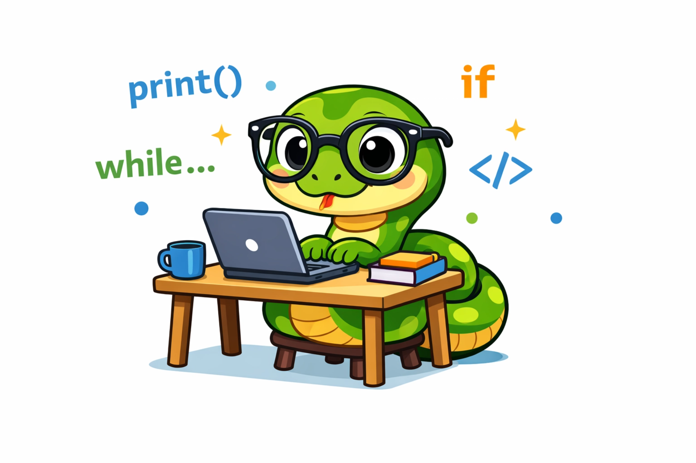

<!--suppress HtmlDeprecatedAttribute -->

  

# Objetivo

Aqui, você encontrará meus estudos em Python.

## Tópicos de estudo

- [Introdução]()
- [Teste1]()
- [Teste2]()
- [Teste3]()
- [Teste4]()
- [Teste5]()

## Licença

Licenciado sob [MIT]().

## Contribuindo

Siga as [diretrizes de contribuição]() para contribuir com o projeto.
